<!--
  This is your PROFILE README. It lives in a repo named exactly Nav-S24
  (github.com/Nav-S24/Nav-S24) so GitHub shows it on your profile.
-->

  

## Navya Saxena

**Learning by building.**

 

<!-- animated contribution graph, refreshed daily by the workflow -->

